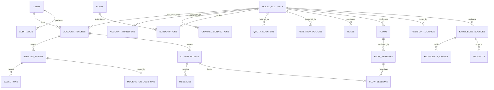
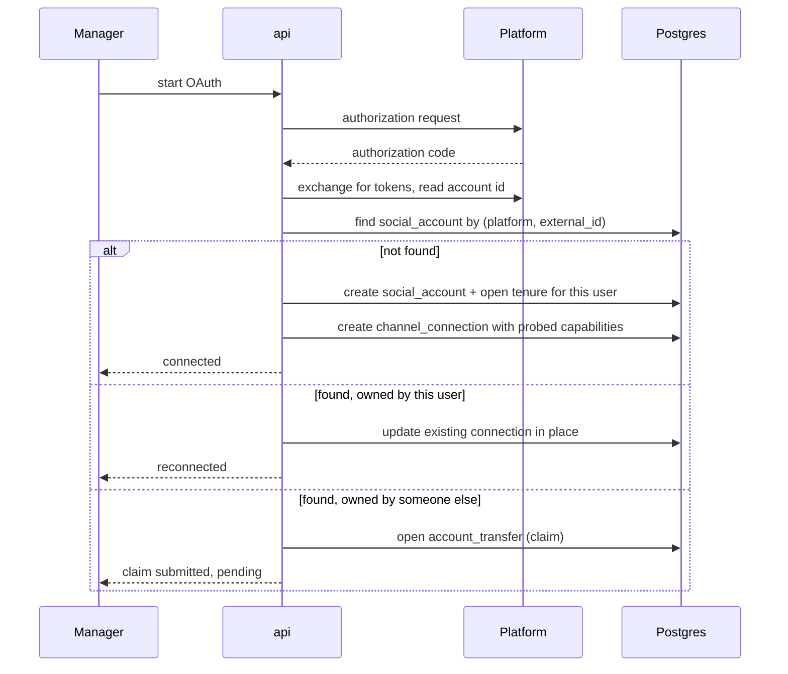
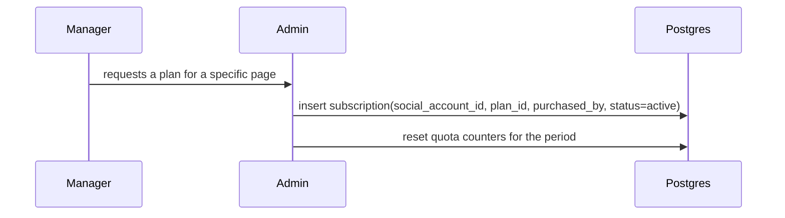
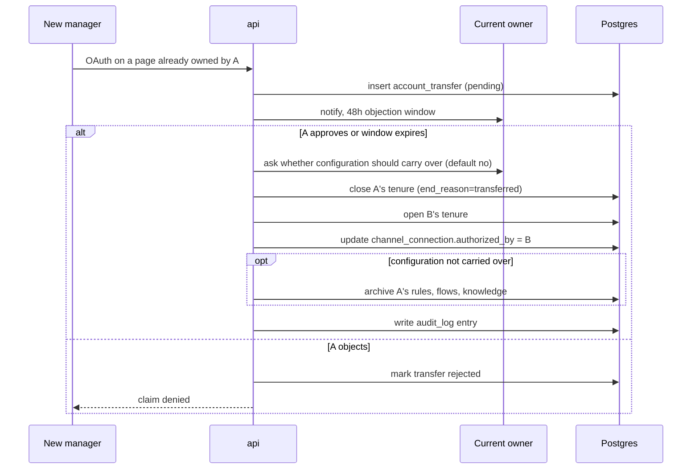
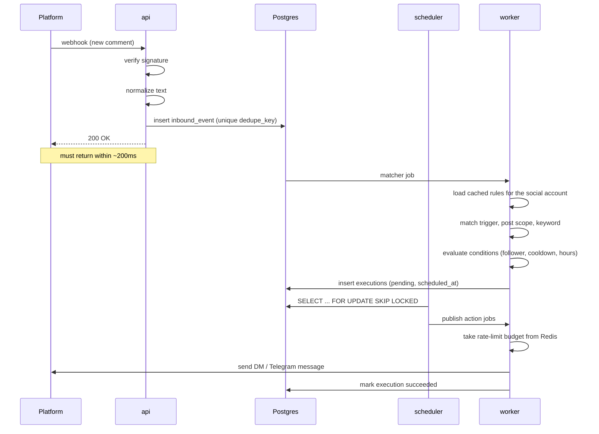
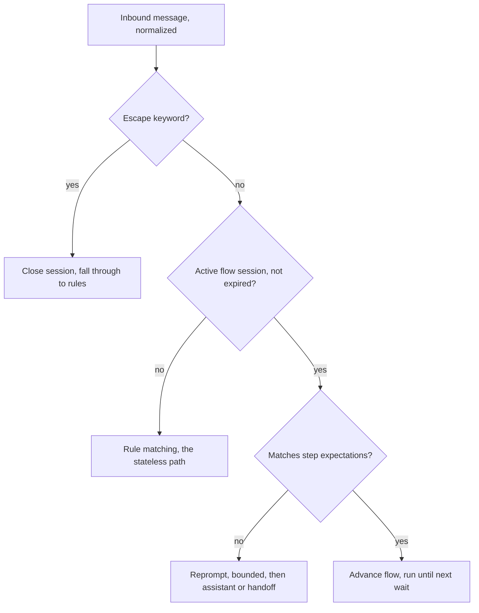
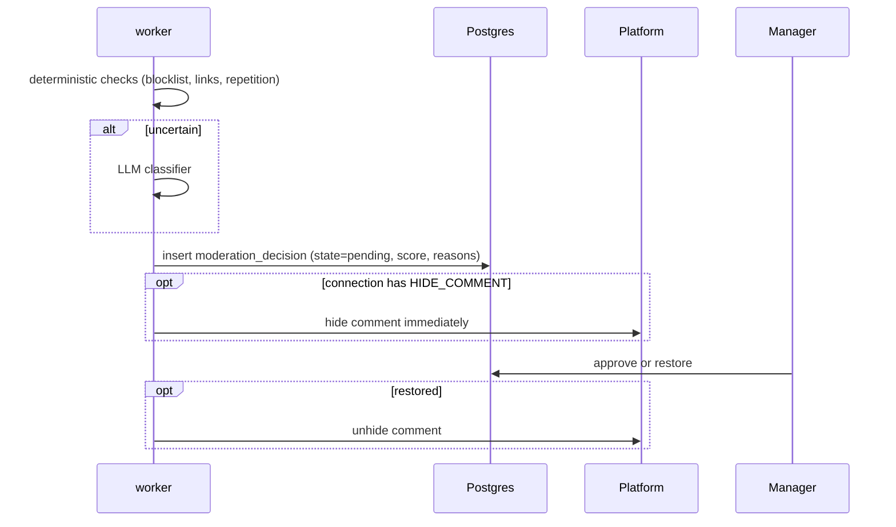
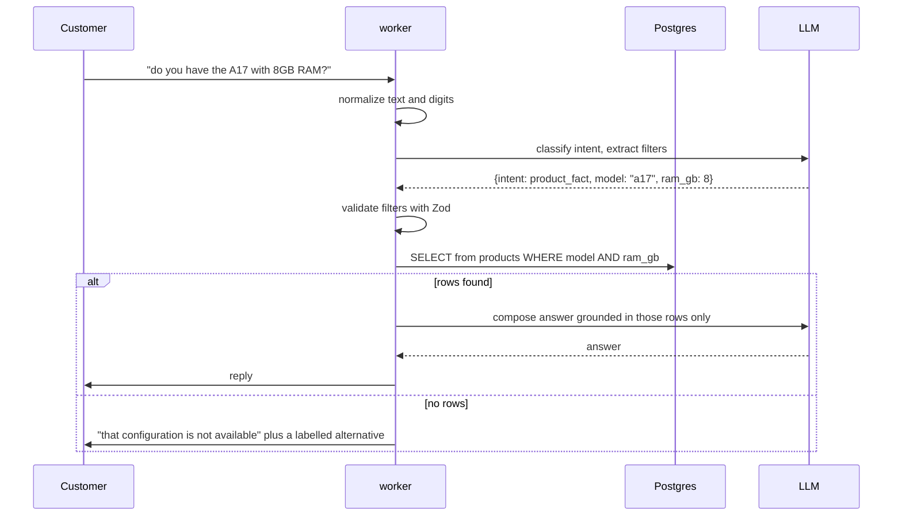
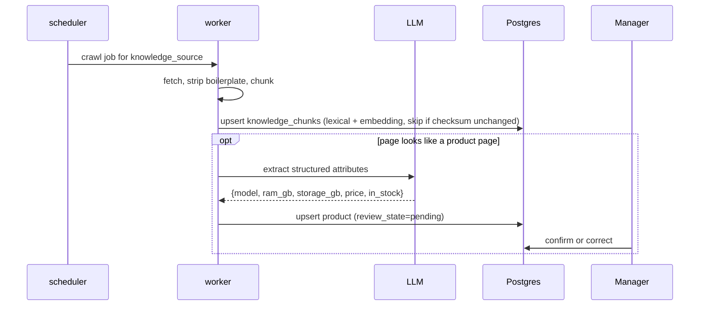

# Social Media Assistant — System Design (v2)

**Status:** design agreed, not yet implemented
**Stack:** NestJS + Fastify, PostgreSQL (+ pgvector), BullMQ, Redis, Docker
**Team assumption:** 1–2 engineers, < 100 connected accounts in the first year

### Changes from v1

| Change | Reason |
|---|---|
| `social_accounts` split out from `channel_connections` | A social account is permanent; an OAuth token is not |
| `account_tenures` introduced | An account can change hands; the next owner must not inherit the previous owner's private conversations |
| Subscription is per social account, not per user | Commercial model: one subscription is bought per page, not per customer |
| `subscription_seats` removed | Made redundant by the above |
| Conversational `flows` added | Stateless rules cannot express multi-turn dialogue |
| `executions.origin_type` / `origin_id` | Actions now originate from either a rule or a flow, but share one execution path |

---

## 1. Scope

A social media manager connects their accounts (Instagram, Telegram, more later) and configures:

1. Automatic replies when a comment matching a pattern appears under a post.
2. Automatic replies when a direct message arrives.
3. Conditions gating those replies (is a follower, cooldown, business hours).
4. Cross-channel routing — a comment can trigger a DM, or a message from a Telegram bot.
5. Multi-turn dialogues that ask a question and branch on the answer.
6. Review of abusive comments instead of blind deletion.
7. An assistant that answers product questions accurately from the manager's own website and posts.

The system is a **modular monolith** deployed as one image running in four roles.

---

## 2. Architecture decisions

| # | Decision | Reason | Revisit when |
|---|---|---|---|
| 1 | Modular monolith, not microservices | One bounded context family; distributed transactions would dominate a 2-person team's time | Team > 6 engineers, or a module needs its own release cadence |
| 2 | One image, four roles via `APP_MODE` | Independent scaling without a second codebase or database | Never — this survives the move to Kubernetes |
| 3 | Single PostgreSQL as source of truth | Eliminates cross-store consistency problems | Write throughput exceeds a single primary |
| 4 | Scheduling and retry state in Postgres, not the broker | Delay, backoff, cancellation and inspection become plain SQL | Never — this is a durability property |
| 5 | BullMQ as transport only, Postgres remains the scheduling authority | Redis is already required for rate limiting/locks (#6), so BullMQ avoids running a second broker service; job IDs are deterministic and the `executions` row — not the job — is what "status" means (decision #4 still holds unchanged) | Job volume needs multiple independent Redis clusters |
| 6 | Redis for rate limiting, locks, cache, and the BullMQ job queue | Token buckets need atomic counters; keep `rl:*`/`lock:*`/`cache:*`/`bull:*` key namespaces distinct so one workload can't starve another | — |
| 7 | Prisma, with raw SQL / TypedSQL where needed | Type safety and painless migrations outweigh query elegance at this scale | Analytical queries dominate development time |
| 8 | pgvector inside the same Postgres | Avoids a second datastore for a small corpus | Corpus exceeds a few million chunks |
| 9 | No PM2 inside containers | Two supervisors hide crashes and break graceful shutdown | Only if deployment moves off containers |
| 10 | Unofficial connector isolated in its own container | A ban or crash must not affect official flows | It becomes a separate service — likely the first extraction |
| 11 | Flows layered on the rule primitives, not a second engine | Matchers, conditions, actions, retries and quotas are reused unchanged | Never |

### Deployment topology

One `Dockerfile`, one image, four services:

| Service | `APP_MODE` | Responsibility | Scaling signal |
|---|---|---|---|
| `api` | `api` | HTTP, webhook receipt, admin panel | Request latency |
| `worker` | `worker` | Rule matching, flow stepping, official API actions, assistant | Queue depth |
| `worker-risky` | `worker` + `QUEUES=risky` | Unofficial connector only, own proxy and session pool | Separately, conservatively |
| `scheduler` | `scheduler` | Outbox dispatch, token refresh, flow timeouts, crawling, purging | Never — but must be safe at N > 1 |

Plus `postgres`, `redis` (also carries the BullMQ job queue). In Kubernetes these become four Deployments sharing the image with different args.

---

## 3. Module map

```
src/
  modules/
    identity/        auth, users
    accounts/        SocialAccount, AccountTenure, ownership transfer
    channels/        ChannelConnection, token refresh, capability discovery
    entitlement/     Plan, Subscription, QuotaCounter (per social account)
    automation/      Rule, RuleMatcher, Execution
    flows/           FlowVersion, FlowSession, step executor
    ingestion/       webhook controllers, pollers, event normalisation
    dispatch/        outbox dispatcher, queue publishing, rate limiting
    moderation/      classification, review queue
    assistant/       knowledge sources, retrieval, answering
    audit/           execution log and ownership audit trail
  connectors/        ports + per-platform adapters
  shared/            crypto, text normalisation, idempotency, scoping, errors
```

### Dependency rules

These two rules are what make future extraction possible. They are not style preferences.

1. **No module may import another module's repository or Prisma models.** Cross-module access goes through the target module's exported service interface, or through a domain event.
2. **No SQL join across module boundaries.** If a report needs data from two modules, denormalise into a read model or compose in application code.

Allowed direction:

```
ingestion → automation → dispatch → connectors
     ↓          ↓
   flows    moderation, assistant (as action runners)
```

`automation` and `flows` must not contain the word "Instagram" anywhere. If they do, the abstraction has leaked.

---

## 4. The ownership model

This is the most important structural change in v2. Three things that v1 conflated are now separate:

| Entity | Nature | Lifetime |
|---|---|---|
| `social_accounts` | The Instagram page / Telegram channel itself, identified by its platform ID | Permanent |
| `account_tenures` | Who manages it during a given period | Changes hands |
| `channel_connections` | The OAuth token and session | Ephemeral; revoked and renewed constantly |

### Data ownership boundary

| Data class | Attached to | Transfers to the next owner? |
|---|---|---|
| Configuration — rules, flows, knowledge sources, products, assistant instructions | `social_account_id` | Only with explicit consent at transfer time; **default no** |
| Conversational data — inbound events, conversations, messages, moderation decisions | `tenure_id` | **Never** |
| Subscription | `social_account_id` | Yes — the subscription belongs to the page |

The reason for the second row: direct messages contain the personal data of third parties who spoke to a *different business*. Handing them to the next owner is a privacy breach, not a feature.

### Ownership must never be inferred from OAuth

If "whoever presents a valid token owns the account" were the rule, any former employee or freelancer with page admin rights could silently take over the account inside the system and read its message history.

A successful OAuth proves the person is *currently* an admin of the page. That is necessary evidence, not sufficient authority. See journey 6.3.

### Constraints

| Table | Constraint | Why |
|---|---|---|
| `social_accounts` | `unique(platform, external_account_id)` | One page cannot be claimed twice |
| `account_tenures` | `unique(social_account_id) where ended_at is null` | Exactly one active owner at any moment |
| `subscriptions` | `unique(social_account_id) where status = 'active'` | One live subscription per page |
| `channel_connections` | soft delete only (`deleted_at`) | Rules, events and tenures all reference it; a hard delete cascades into data loss |

**Invariant:** a re-authorisation is an `UPDATE` of the existing connection row, never a delete-and-recreate.

---

## 5. Domain model



### Indexes that matter

| Table | Index | Purpose |
|---|---|---|
| `inbound_events` | `unique(dedupe_key)` | Platforms redeliver webhooks; without this the user gets two replies |
| `executions` | `unique(origin_type, origin_id, event_id, action_index)` | Exactly-once effect under unlimited retries |
| `executions` | `(status, next_attempt_at)` | The dispatcher's only hot query |
| `flow_sessions` | `unique(conversation_id) where status = 'awaiting'` | One live dialogue per conversation |
| `knowledge_chunks` | HNSW on `embedding`, GIN on `lexical` | Hybrid retrieval needs both |
| `products` | `(social_account_id, model, ram_gb, storage_gb)` | Exact attribute lookups |
| `conversations` | `(tenure_id, participant_hash)` | Message routing and cooldown checks |

### Execution state machine

```
pending → dispatched → running → succeeded
                          ↓
                        failed → (attempts < max) → pending
                          ↓
                     dead_lettered
```

`scheduled_at` controls delay. `next_attempt_at` controls backoff. Both live on the row, so disabling a rule or cancelling a flow cancels pending work with one `UPDATE`.

---

## 6. Journeys

### 6.1 Sign up and connect an account



Capabilities are **probed per adapter**, never assumed. `ChannelConnection.capabilities` stores the resolved set.

### 6.2 Buy a subscription (MVP: manual activation)



One subscription per social account. `purchased_by` records who paid; it does **not** grant ownership.

Payment is out of scope for the MVP, but **entitlement is not**. Every rule save and every action execution passes through:

```ts
assertAllowed(socialAccountId: string, metric: Metric): Promise<void>
```

When a real gateway arrives, it writes the same subscription row and nothing else changes.

### 6.3 Ownership transfer



Until the moment of transfer, automations keep running on the old token — a contested claim must not silently break a live business.

Every transfer is audited. That audit trail is what settles the dispute when two customers claim the same page.

### 6.4 Comment triggers a reply — the canonical automation



Failure paths:

- **Duplicate webhook** → unique violation on `dedupe_key`, ignored, still returns 200.
- **Rate limit exhausted** → job acked, execution row gets a new `next_attempt_at`. Nothing stalls in the broker.
- **429 from platform** → exponential backoff on the row, circuit breaker opens for that connection.
- **Event authored by the managed account itself** → dropped before matching. Without this, an automated reply triggers the rule that produced it.
- **Per-author cooldown exceeded** → condition fails, no execution created.
- **No active subscription** → still returns 200, but creates no executions. Returning an error would make the platform disable the webhook permanently.

### 6.5 Direct message triggers a reply

Identical to 6.4 with `trigger.type = 'dm.received'` and no post scope, plus two additions: the event is appended to a `conversation`, and `window_expires_at` is refreshed. DMs have continuity; comments generally do not.

### 6.6 Multi-turn dialogue

The scenario: the customer sends "price", the system asks "are you in the UAE?", and branches on yes/no.

Routing precedence for every inbound message:



The flow graph, stored as JSONB in `flow_versions.graph`:

```json
{
  "entry": "ask_location",
  "steps": {
    "ask_location": {
      "type": "ask",
      "message": "Are you in the UAE?",
      "saveAs": "in_uae",
      "expects": [
        { "matcher": { "mode": "contains", "values": ["yes", "yeah"] }, "next": "send_price" },
        { "matcher": { "mode": "contains", "values": ["no", "nope"] },  "next": "no_shipping" }
      ],
      "timeoutSeconds": 43200,
      "onTimeout": "close",
      "onNoMatch": { "reprompt": "Please answer yes or no", "max": 2, "then": "assistant" }
    },
    "send_price":  { "type": "action", "action": { "type": "platform.send_message", "params": { "text": "..." } }, "next": "end" },
    "no_shipping": { "type": "action", "action": { "type": "platform.send_message", "params": { "text": "We don't ship there yet" } }, "next": "end" },
    "assistant":   { "type": "handoff", "to": "assistant" },
    "end":         { "type": "end" }
  }
}
```

Step types: `send`, `ask`, `branch`, `action`, `handoff`, `end`.

What is reused rather than rebuilt:

- `expects` uses the **same matcher structure** as rules — Persian normalisation, regex and contains come for free.
- `action` steps use the **same ActionRunner registry** — retries, rate limits, quotas and logging are unchanged.
- `branch` uses the **same condition tree** — a mid-dialogue "is a follower" check needs no new code.
- Timeouts use the **same `scheduled_at` mechanism** — an execution of type `flow.timeout` scheduled ahead, cancelled by an `UPDATE` when the answer arrives early.

Four details that break this in production if omitted:

1. **Per-conversation serialisation.** If two messages arrive in quick succession, two workers race on one session. Lock the session row with `SELECT ... FOR UPDATE`, or take an advisory lock on `conversation_id`. This is the only place in the system where parallelism is forbidden.
2. **Timeout shorter than the platform messaging window.** Instagram only allows replies within 24h of the customer's last message. A session that waits 48h will resume and then fail to send. Use 12h.
3. **Bounded reprompts.** Without `max`, a customer who types something unexpected receives the same question forever.
4. **Immutable flow versions.** Sessions pin `flow_version_id`. Editing a flow must not corrupt live dialogues; running sessions finish on the old version.

### 6.7 Abusive comment goes to review



The cheap deterministic layer runs first so the LLM is paid for only on uncertain cases. Hiding is reversible; deleting is not. The stored `score` and `reasons` are what let the manager tune the threshold — without them the threshold is guesswork forever.

This is still just a rule: `matcher.mode = 'any'`, condition `content.is_abusive`, action `platform.hide_comment`. No separate subsystem.

### 6.8 Product question answered accurately



Non-factual questions (shipping, warranty, hours) take the same entry point but run **hybrid retrieval**: `tsvector` keyword search and `pgvector` similarity, fused with reciprocal rank fusion, then a grounded answer.

**The rule that prevents the known failure mode:** for product facts there is no nearest-neighbour fallback. Vector search returns the *most similar* chunk, and "A17 128GB" is highly similar to "A17 256GB" — which is exactly why it must never answer a specification question. If the structured filter returns nothing, the answer is "not available", optionally followed by an explicitly labelled alternative: *"We don't have 8GB; the 12GB model is in stock."*

### 6.9 Knowledge ingestion



Extraction happens once, offline, and is reviewable — the same pattern as moderation. Numeric normalisation ("۲۵۶ گیگ", "256GB", "1TB") applies at index time *and* query time; without it, exact filters silently miss.

### 6.10 Token expiry and re-authorisation

The scheduler refreshes tokens ahead of expiry. On an auth failure at execution time:

1. The connection is marked `needs_reauth`.
2. Pending executions for that account are **parked**, not retried. Retrying a revoked token forever is the fastest way to burn a rate limit.
3. The manager is notified.
4. On re-authorisation, the connection row is updated in place — but only if the authorising user holds the active tenure. Otherwise the claim path in 6.3 opens instead.

### 6.11 Subscription expiry

1. `grace_until` passes → subscription becomes `expired`.
2. Rules and flows are **disabled, not deleted**. Renewal restores everything.
3. Ingestion still accepts webhooks and returns 200, but creates no executions.
4. Live flow sessions are closed with a neutral message rather than left hanging.

An abrupt cutoff costs a business real customers, and they have no way to apologise to the people who messaged them. The grace window is not a courtesy; it is churn prevention.

### 6.12 Retention and purge

A scheduled job reads `retention_policies` and purges by class:

| Data | Policy |
|---|---|
| Comment / DM body | TTL 30–90 days, then the body is deleted and the metadata row kept |
| Platform user ID | Kept only while the conversation is open, then nulled |
| `author_ref_hash` | HMAC with a per-account key, kept indefinitely for cooldown and analytics |
| Username, avatar | Never stored; fetched on demand for display |
| Access tokens | AES-GCM encrypted at rest; never logged, never returned by any API |
| Closed tenure data | Purged on the tenure's own TTL after `ended_at` |
| Analytics | Aggregate counters only, no identities |

Hashing is for values that must be **compared but not read**. Message bodies cannot be hashed — they must be readable to be answered. Per-account HMAC keys prevent correlating the same end user across two different managers' data.

**Log redaction is mandatory.** A pino serializer strips message bodies, tokens and external IDs. In systems of this kind the largest leak is almost always the log pipeline, not the database.

---

## 7. Rule and flow engine

```ts
type Rule = {
  id: string
  socialAccountId: string
  enabled: boolean
  priority: number
  trigger: { type: 'comment.created' | 'dm.received'; scope: { postIds?: string[] } }
  matcher: { mode: 'exact' | 'contains' | 'regex' | 'any'; values: string[]; caseSensitive: boolean }
  conditions: ConditionNode      // AND/OR tree
  actions: Action[]              // ordered, each with optional delaySeconds
}
```

`ConditionNode` and `Action` are polymorphic JSONB validated by a Zod registry keyed on `type`. Matching runs **in memory** over rules cached per account — never as a JSONB query. Pushing rule evaluation into SQL leaks domain logic into the database and is the easiest way to ruin this design.

### Extension point

Adding a capability for a new platform requires no migration and no engine change:

```ts
@RegisterAction('telegram.send_message')
export class SendTelegramMessage implements ActionRunner<Params> {
  schema = z.object({ text: z.string().max(4096), buttons: z.array(ButtonSchema).optional() })
  requiredCapability = Capability.SEND_MESSAGE
  async execute(ctx: ExecutionContext, params: Params): Promise<ActionResult> { /* ... */ }
}
```

NestJS `DiscoveryService` collects these at boot. The rule builder UI renders its form from the same Zod schema, so backend and frontend cannot drift.

### Capabilities

```ts
enum Capability {
  SEND_MESSAGE, SEND_DM, DELETE_COMMENT, HIDE_COMMENT, FOLLOW_CHECK, READ_POSTS
}
```

Instagram's official Graph API cannot tell you whether a user follows an account; the unofficial adapter can. Each adapter declares its capability set; the connection stores the resolved set. A condition requiring `FOLLOW_CHECK` is hidden in the UI and rejected on save when the connection lacks it. **Capability is discovered, never assumed.**

---

## 8. Connector layer

```ts
interface PlatformAdapter {
  readonly platform: Platform
  readonly capabilities: Set<Capability>
  readonly risk: 'official' | 'unofficial'

  verifyWebhook(req: RawRequest): boolean
  resolveAccountIdentity(tokens: Tokens): Promise<{ externalAccountId: string; displayName: string }>
  normalize(payload: unknown): NormalizedEvent[]
  sendMessage(conn: Connection, target: Target, msg: OutboundMessage): Promise<SendResult>
  hideComment(conn: Connection, commentId: string): Promise<void>
  isFollower?(conn: Connection, userRef: string): Promise<boolean>
}
```

`NormalizedEvent` is the anti-corruption boundary. Everything downstream sees only this shape:

```ts
type NormalizedEvent = {
  platform: Platform
  socialAccountId: string
  tenureId: string
  type: 'comment.created' | 'dm.received'
  externalId: string
  dedupeKey: string
  authorExternalId: string
  authorRefHash: string
  rawText: string
  normalizedText: string
  normalizerVersion: number
  context: { postId?: string; parentCommentId?: string }
  occurredAt: Date
}
```

Adapters marked `unofficial` are routed to the `risky` queue and only ever execute inside `worker-risky`, with their own proxy and session pool, tighter throttles and separate resource limits.

---

## 9. Reliability rules

Each one prevents a specific production failure.

1. **Idempotent ingestion.** `dedupe_key = platform:accountId:type:externalId` with a unique index.
2. **Transactional outbox.** Postgres writes and broker publishes cannot share a transaction. The event and its `pending` executions are written in one transaction; the dispatcher publishes afterwards.
3. **`SELECT ... FOR UPDATE SKIP LOCKED`** when claiming executions. Makes multiple dispatchers safe and removes the need for a singleton scheduler.
4. **Loop prevention.** Ignore events authored by the managed account; enforce per-author cooldown.
5. **Per-conversation locking** while stepping a flow session.
6. **Per-connection token bucket** in Redis, consumed before the API call, not after.
7. **Circuit breaker per connection.** Open on repeated 5xx or 429; park executions instead of hammering.
8. **Graceful shutdown.** `enableShutdownHooks`, stop consuming, finish in-flight jobs, ack correctly. SIGTERM must reach the Node process directly — hence no process manager inside the container.
9. **Dead letter with a reason.** A dead-lettered execution is product-visible: the manager should see "this reply failed because the token expired", not silence.

---

## 10. Conventions

**Scoping.** One `PrismaScope` layer enforces both dimensions: configuration filtered by `social_account_id`, conversational data filtered by `tenure_id`. A single forgotten filter is a data leak between two owners of the same page — this belongs in one place, not in every service.

**Text normalisation.** Every text is stored twice: `raw_text` and `normalized_text`. Matching runs only on the normalised form, and the same function must run when a *rule or flow* is saved — otherwise a manager typing Arabic ي will never match a user typing Persian ی. The normaliser is versioned and rows record which version processed them. It covers Arabic/Persian letter unification, ZWNJ, diacritics, Arabic/Persian digits, emoji, whitespace collapse and unit expressions.

**Validation.** Zod at every boundary — HTTP DTOs, webhook payloads, action params, flow graphs, LLM structured output. LLM output is untrusted input and gets the same treatment as a public HTTP body.

**Errors.** One `AppError` hierarchy with stable `code`s, mapped to HTTP by a single Fastify filter. Never leak platform error text to the API surface.

**Observability.** Structured logs with `eventId` as the correlation ID through the whole pipeline. The per-rule and per-flow execution log is a product feature: the most common support question will be "why didn't my automation fire?", and the answer must be self-service.

**Testing priority.** In order: rule matching (pure, table-driven, cheap), condition evaluation, flow stepping including timeout and reprompt paths, idempotency and retry against a real Postgres in Testcontainers, adapters against recorded fixtures. Do not mock Prisma.

**Migrations.** Expand/contract only. Never drop a column in the same release that stops writing it.

---

## 11. Open decisions

| Item | Status |
|---|---|
| LLM provider | A cloud model; provider not fixed, kept behind `AssistantPort` |
| Monthly LLM budget | Undecided — drives caching and classifier thresholds |
| Exact retention TTLs | Legal decision; defaults proposed above |
| Remaining subscription time on transfer | Assumed to follow the page; refund policy undefined |
| Objection window length for claims | 48h assumed |
| Unofficial adapter implementation | Accepted in principle; session and proxy strategy not designed |
| Rule and flow builder UX | Out of scope for this document |

---

## 12. Build order

1. `identity`, `accounts`, `channels` with the Telegram adapter — the simplest official API, proves the connector abstraction and the tenure model end to end.
2. `ingestion` + `automation` + `dispatch` with one action (`send_message`) and one condition (`cooldown`). This is the spine.
3. Instagram official adapter. The abstraction is now tested by a second platform.
4. `entitlement` with manual activation, plus the expiry and grace behaviour.
5. `flows` — the step executor, reusing everything from step 2.
6. Ownership transfer and the claim flow.
7. `moderation`, deterministic layer only.
8. `assistant`: catalog lookup first, hybrid text retrieval second.
9. The unofficial adapter, last — by then the isolation boundary is real and enforced.

Steps 1 and 2 together are the actual product. Everything after is additive, which is the point of the design.
